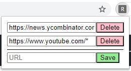
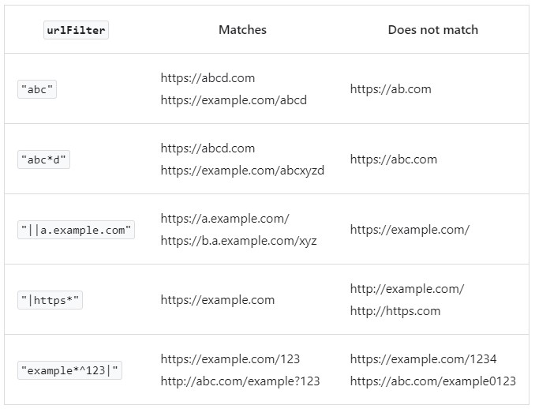

# WebsiteBlocker

<ins>Lightweight Chrome extension for blocking distracting websites.</ins> 
Technically it simply blocks any request from marked websites using [chrome.declarativeNetRequest API](https://developer.chrome.com/docs/extensions/reference/declarativeNetRequest/). In practice this looks like the websites don't have access to the internet.  
<ins>Privacy note</ins>: This extension doesn't collect/send/share any data, everything (basically just urls) is kept inside local chrome.storage for extensions.
 
 

 

 

<ins>Filtering rules</ins> - basically chrome.declarativeNetRequest API [filtering rules](https://developer.chrome.com/docs/extensions/reference/declarativeNetRequest/#rules) are applied

 

